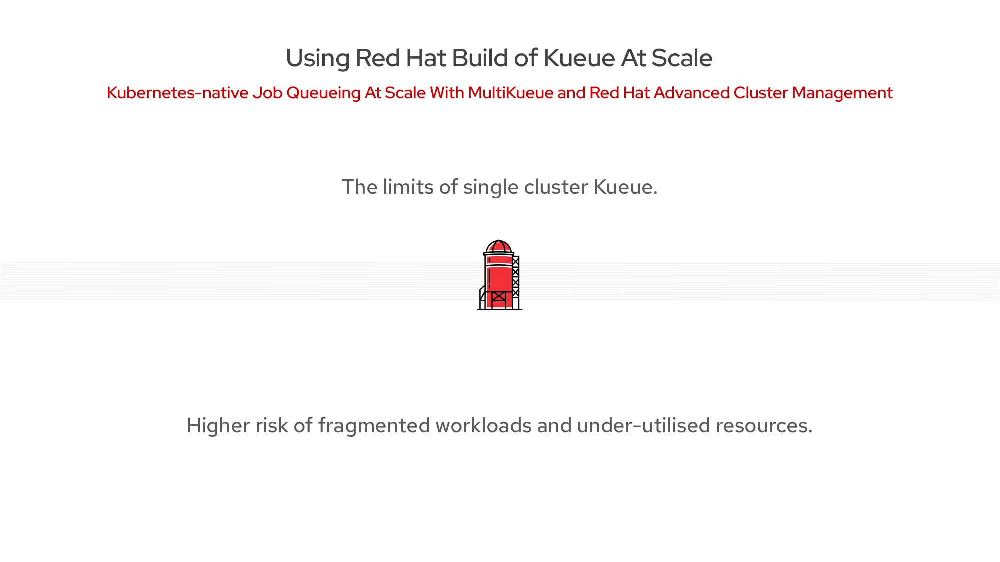
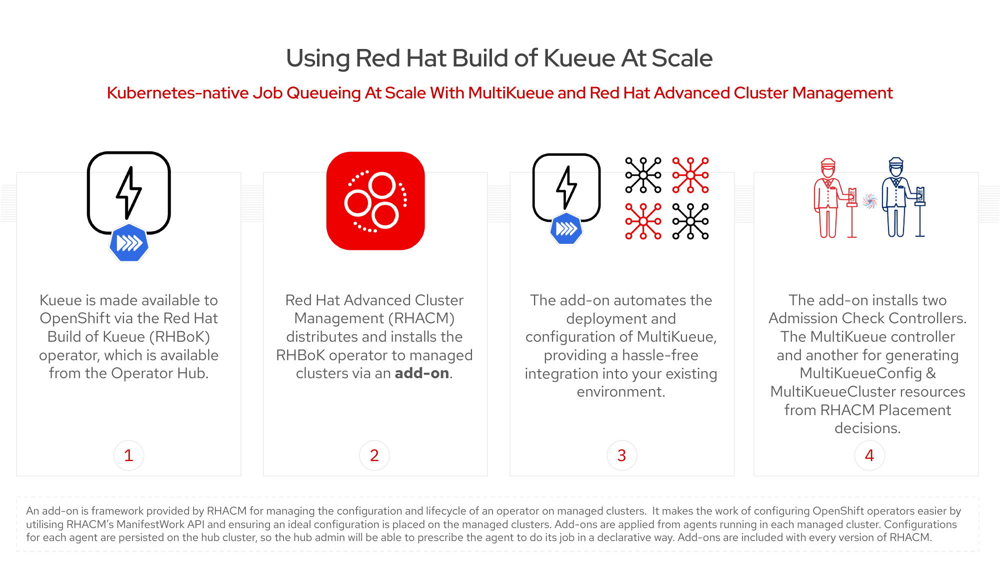
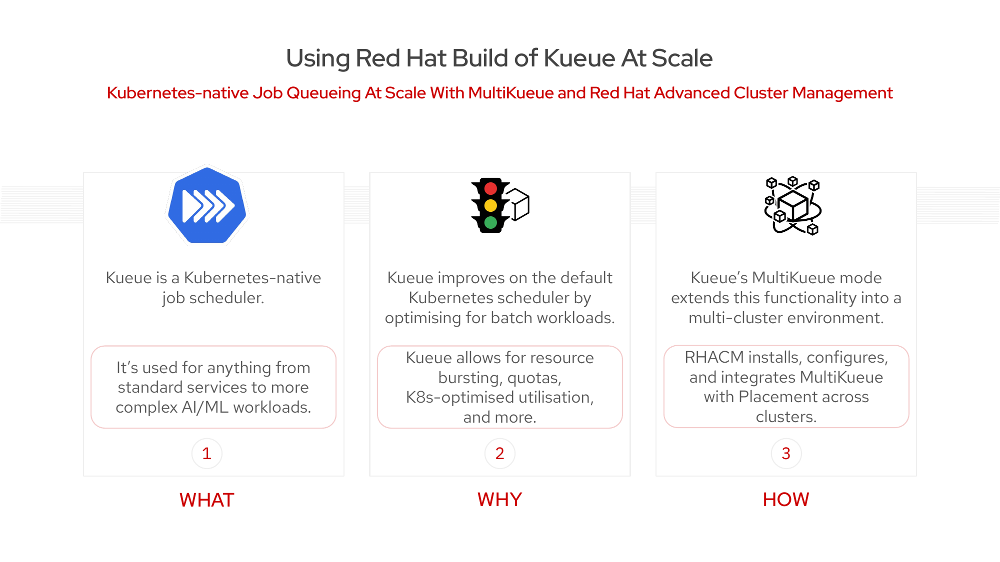
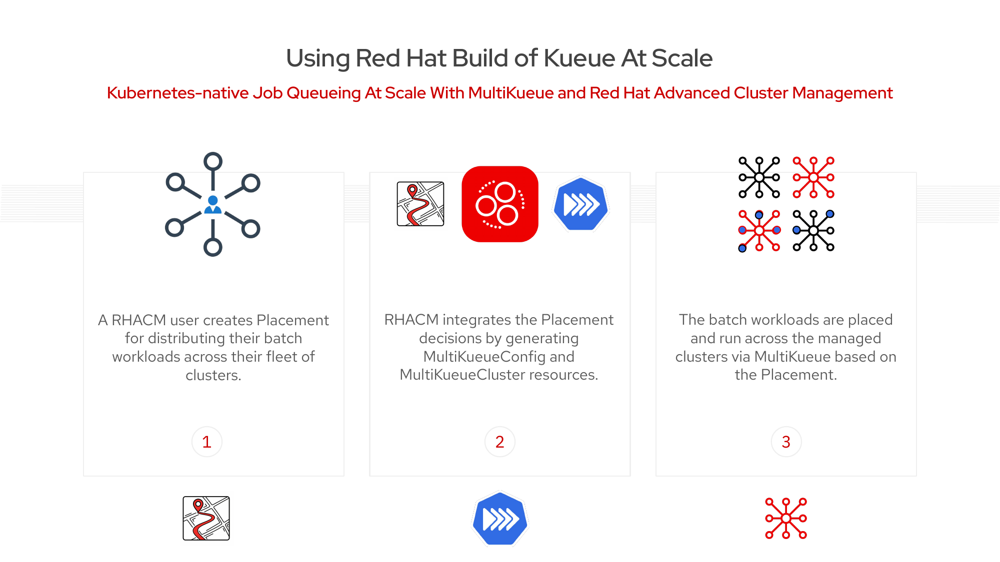
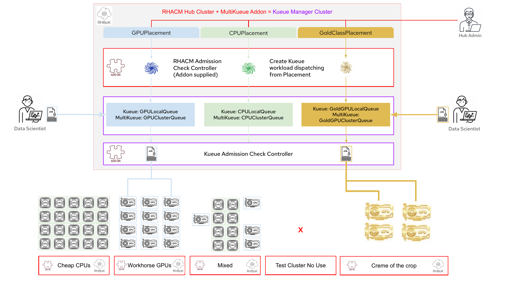
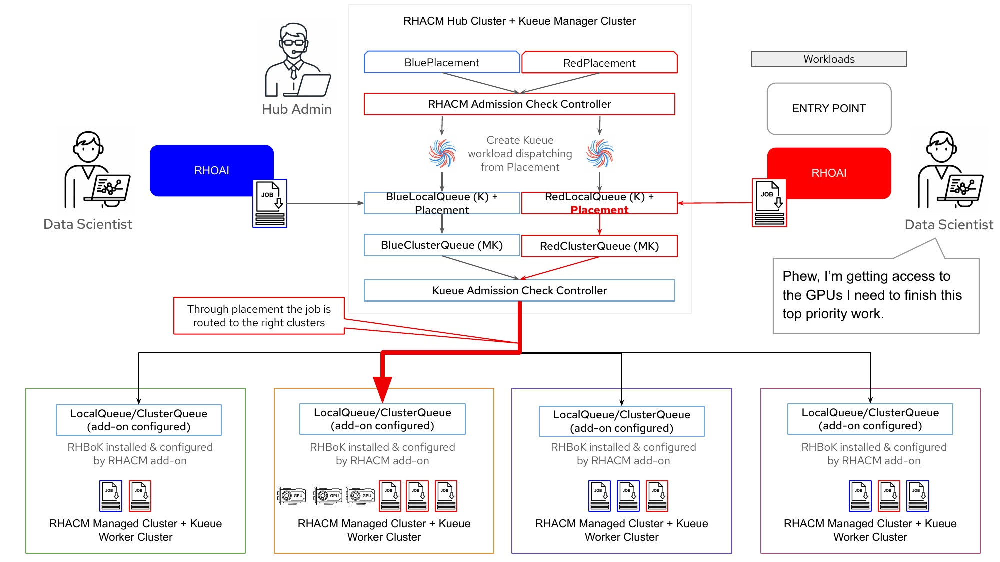
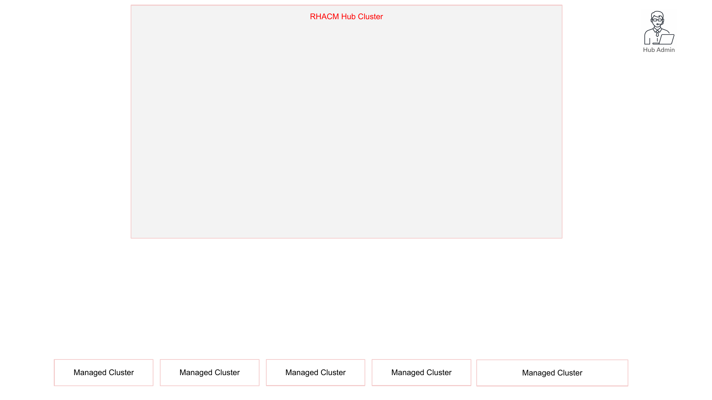
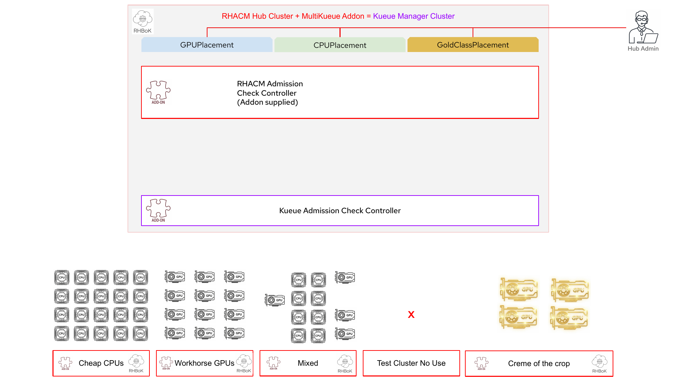
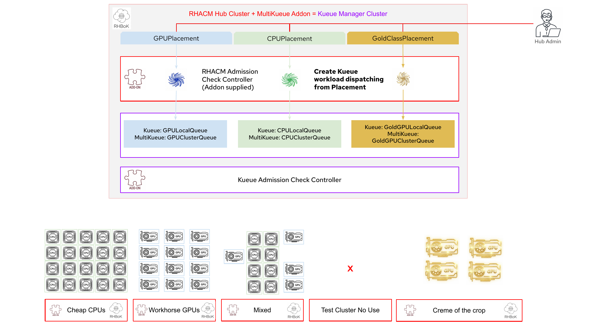

# \<Customer Name\>

# GPU-as-a-Service with RHACM and MultiKueue

## Proof of Concept — Label-Based Multi-Cluster GPU Scheduling

**Prepared for:**
\<Customer Legal Name\>

**Date Delivered:** \<Date\>

**Version:** 1.1

---

## Executive Summary

This Proof of Concept demonstrates **GPU-as-a-Service** across a fleet of OpenShift clusters using Red Hat Advanced Cluster Management (RHACM) and the Red Hat Build of Kueue (RHBoK) with MultiKueue:

- **Single submission point:** Data scientists submit GPU jobs to one queue on the hub cluster. No knowledge of cluster topology or GPU availability is required.
- **Label-based routing:** Managed clusters are labeled with their GPU hardware type. RHACM Placement dynamically selects only matching clusters — no hardcoded targets.
- **Fully automated plumbing:** The RHACM Kueue Addon deploys Kueue to spoke clusters, generates MultiKueue configuration from Placement decisions, and keeps everything in sync as the fleet changes.
- **Dynamic adaptation:** Adding or removing GPU labels on clusters automatically updates the routing configuration. No manual MultiKueueConfig editing is required.
- **Clear separation of concerns:** Platform administrators manage Placements and labels. Data scientists submit to a queue. Everything else is automated.

> **Support Status:** The Kueue Addon for RHACM premiered as **Developer Preview in RHACM 2.15**. Please review the [Scope of Support for Developer Preview](https://access.redhat.com/support/offerings/devpreview) and check with Red Hat for the most recent support offering before using in production.

---

## Table of Contents

- [1. PoC Objective](#1-poc-objective)
- [2. Business Context](#2-business-context)
- [3. Key Terminology](#3-key-terminology)
- [4. Kueue Fundamentals](#4-kueue-fundamentals)
- [5. Solution Overview](#5-solution-overview)
- [6. Architecture Deep Dive](#6-architecture-deep-dive)
- [7. Scope of PoC](#7-scope-of-poc)
- [8. Success Criteria](#8-success-criteria)
- [9. Demo Environment](#9-demo-environment)
- [10. Step-by-Step Execution Guide](#10-step-by-step-execution-guide)
- [11. Troubleshooting](#11-troubleshooting)
- [12. Roles and Responsibilities](#12-roles-and-responsibilities)
- [13. Timeline](#13-timeline)
- [14. Assumptions and Prerequisites](#14-assumptions-and-prerequisites)
- [15. Future Extensions (Beyond This PoC)](#15-future-extensions-beyond-this-poc)
- [16. Reference Links](#16-reference-links)
- [17. Next Steps](#17-next-steps)
- [18. Confidentiality / Copyright / Account Team](#18-confidentiality--copyright--account-team)

---

## 1. PoC Objective

This Proof of Concept (PoC) demonstrates the capability of **Red Hat Advanced Cluster Management (RHACM)** combined with the **Red Hat Build of Kueue (RHBoK)** and its **MultiKueue** extension to deliver **GPU-as-a-Service** across a fleet of OpenShift clusters. The PoC validates that AI/ML workloads submitted to a single hub cluster are **automatically routed to the correct GPU-equipped clusters** using RHACM's Placement API and label-based cluster selection — without data scientists needing to know which clusters exist or how to configure them.

The core scenario demonstrated is **Label-Based Multi-Cluster GPU Scheduling**: managed clusters are labeled with their GPU hardware type (e.g., `accelerator=nvidia-tesla-t4`), and the system dynamically routes GPU jobs only to clusters that match the required hardware.

### Personas Involved

This PoC addresses two distinct personas, aligned with the [Red Hat Build of Kueue persona model](https://docs.redhat.com/en/documentation/openshift_container_platform/4.18/html/ai_workloads/red-hat-build-of-kueue):

| Persona | Kueue Role | PoC Responsibility |
|---------|------------|-------------------|
| **Platform Administrator** | Batch Administrator | Creates Placements, labels clusters, manages ClusterQueues and quotas |
| **Data Scientist** | Batch User | Submits jobs to a LocalQueue — no infrastructure knowledge required |

---

## 2. Business Context

### The Growth of AI/ML Workloads

With the explosive growth of Large Language Models (LLMs) and generative AI, workload scale and complexity have exceeded the boundaries of a single cluster. Organizations are increasingly adopting multi-cluster, multi-cloud, and hybrid cloud architectures to access computing power, optimize costs, and meet compliance requirements.

### The Problem: Multi-Cluster GPU Management

Managing AI/ML workloads across multiple clusters presents significant challenges:

| Challenge | Description |
|-----------|-------------|
| **Hardware Heterogeneity** | Your fleet is not uniform. You have expensive clusters (NVIDIA H100s) for training and commodity clusters (CPUs/NVIDIA T4s) for inference. Sending a training job to a CPU cluster is a disaster. |
| **Resource Fragmentation** | 100 GPUs available across your fleet, but scattered as "2 free here, 3 free there." You can't run a distributed job that requires 8 contiguous GPUs. |
| **Low Utilization** | "Some clusters are very busy while others are idle," resulting in low overall GPU utilization across the fleet. |
| **Operational Complexity** | Manually configuring and managing batch job scheduling across an entire fleet is a constant headache. |

### Two Personas Feel the Pain

**Data Scientists** say:

> *"I have access to multiple OpenShift clusters, but each one only has a few GPUs available! I can't run my large training jobs!"*

> *"Which cluster is best for my training job? I don't want to hunt for GPUs."*

**Platform Administrators** say:

> *"Why is no one using these GPUs? Our cluster utilization is terrible."*

> *"How do I configure all these Kueues? I'm not a Kueue expert!"*

### Why Single-Cluster Kueue Is Insufficient

Kueue excels at scheduling batch workloads within a single cluster. However, in multi-cluster environments, it cannot:

- Route jobs across clusters based on hardware type
- Dynamically select the best cluster based on resource availability
- Provide a unified submission point for data scientists

**Result:** Fragmented workloads, under-utilized GPUs, and frustrated teams.

### Current State vs. Desired State

**The Limits of Single-Cluster Kueue:**



*Figure: Without MultiKueue, data scientists are left hunting for GPUs across fragmented clusters, while platform admins struggle with under-utilized resources.*

**The desired state — GPU-as-a-Service — is what this PoC delivers.**

---

## 3. Key Terminology

Before diving into the solution architecture, it is important to understand the key terms used throughout this document. These terms span three domains: Kueue (job scheduling), RHACM (multi-cluster management), and MultiKueue (multi-cluster job dispatch).

### Kueue Resources

| Term | Definition |
|------|-----------|
| **ResourceFlavor** | A cluster-scoped resource that maps to a set of node labels and taints, representing a type of hardware. For example, a flavor might represent nodes with NVIDIA Tesla T4 GPUs. |
| **ClusterQueue** | A cluster-scoped resource that governs a pool of resources (CPU, memory, GPU) with defined quotas, scheduling policies, and admission controls. Created by batch administrators. |
| **LocalQueue** | A namespace-scoped resource that serves as the entry point for users to submit workloads. Each LocalQueue points to a ClusterQueue. |
| **Workload** | Kueue's internal representation of a submitted job. Tracks the job's lifecycle through admission, scheduling, and completion. |
| **AdmissionCheck** | A gate attached to a ClusterQueue that must be satisfied before a workload is admitted. Used to integrate external decision systems such as MultiKueue and RHACM Placement. |
| **Cohort** | A group of ClusterQueues that can share (borrow) unused resources from each other, enabling flexible resource allocation across teams. |
| **Preemption** | The ability to evict running workloads to free resources for higher-priority or quota-reclaiming workloads. |

### RHACM Resources

| Term | Definition |
|------|-----------|
| **ManagedCluster** | An OpenShift cluster that is registered with and managed by RHACM. |
| **ManagedClusterSet** | A logical grouping of ManagedClusters for organizational and access control purposes. The `global` set includes all clusters. |
| **Placement** | An RHACM resource that defines criteria (labels, scores, CEL expressions) for selecting which managed clusters should receive workloads. |
| **PlacementDecision** | An RHACM-generated resource listing the clusters that satisfy a Placement's selection criteria. Updated automatically when cluster labels change. |
| **Kueue Addon** | An RHACM addon (`multicluster-kueue-manager`) that automates Kueue deployment, configuration, and MultiKueue setup across managed clusters. |

### MultiKueue Resources

| Term | Definition |
|------|-----------|
| **MultiKueue** | A subproject of Kueue that extends job scheduling from a single cluster to multiple clusters, dispatching jobs from a hub to spoke clusters. |
| **MultiKueueConfig** | A resource listing the remote clusters eligible to receive dispatched workloads. In this PoC, it is auto-generated from the PlacementDecision. |
| **MultiKueueCluster** | A resource representing a remote cluster's connection status in the MultiKueue system. Created by the Kueue Addon for each managed cluster. |

---

## 4. Kueue Fundamentals

This section provides the foundational Kueue concepts needed to understand the multi-cluster GPU scheduling solution. Readers already familiar with Kueue may skip to [Section 5: Solution Overview](#5-solution-overview).

### The Kueue Resource Hierarchy

Kueue organizes job scheduling through a layered resource hierarchy. Each layer serves a distinct purpose:

```
┌─────────────────────────────────────────────────────────────┐
│                   ResourceFlavor                            │
│   Defines hardware characteristics (node labels, taints)    │
│   Example: nodes with nvidia.com/gpu.present=true           │
└──────────────────────────┬──────────────────────────────────┘
                           │ referenced by
┌──────────────────────────▼──────────────────────────────────┐
│                    ClusterQueue                              │
│   Cluster-scoped resource pool with:                        │
│   • Resource quotas (CPU, memory, GPU)                      │
│   • Scheduling policies                                     │
│   • AdmissionChecks (gates for external decisions)          │
│   Created by: Batch Administrators                          │
└──────────────────────────┬──────────────────────────────────┘
                           │ referenced by
┌──────────────────────────▼──────────────────────────────────┐
│                     LocalQueue                               │
│   Namespace-scoped entry point for users                    │
│   Points to a specific ClusterQueue                         │
│   Created by: Batch Administrators                          │
└──────────────────────────┬──────────────────────────────────┘
                           │ jobs submitted to
┌──────────────────────────▼──────────────────────────────────┐
│                      Workload                                │
│   Kueue's internal object representing a submitted job      │
│   Tracks: Pending → Admitted → Running → Finished           │
│   Created by: Kueue (automatically from user's Job)         │
└─────────────────────────────────────────────────────────────┘
```

### How a Job Flows Through Kueue

The lifecycle of a Kueue-managed job follows these steps:

1. **Submission:** A user creates a Kubernetes Job (or PyTorchJob, RayJob, etc.) with `suspend: true` and a `kueue.x-k8s.io/queue-name` label pointing to a LocalQueue.
2. **Workload creation:** Kueue detects the job and creates a corresponding `Workload` object to track it.
3. **Admission:** Kueue evaluates the workload against the ClusterQueue's quotas and any configured AdmissionChecks. If all checks pass and quota is available, the workload is admitted.
4. **Scheduling:** Upon admission, Kueue unsuspends the job and injects node affinity based on the ResourceFlavor. The Kubernetes scheduler assigns pods to nodes.
5. **Completion:** The job runs to completion. Kueue updates the Workload status and releases the reserved quota.

### Workload States

| State | Description |
|-------|-------------|
| **Pending** | Job submitted but waiting for quota availability or AdmissionCheck approval |
| **Admitted** | Job accepted — quota reserved and AdmissionChecks satisfied |
| **Running** | Job actively executing on allocated resources |
| **Finished** | Job completed successfully or failed |

### Single-Cluster vs. Multi-Cluster Kueue

| Capability | Single-Cluster Kueue | MultiKueue (This PoC) |
|------------|----------------------|----------------------|
| Job scheduling | Within one cluster | Across multiple clusters |
| Resource visibility | Local cluster resources only | Fleet-wide resource pool |
| Submission point | Per-cluster LocalQueue | Single hub LocalQueue |
| Hardware selection | ResourceFlavor node labels | Placement label selectors + ResourceFlavors |
| Configuration | Manual per cluster | Automated by Kueue Addon |

### Namespace Management

> **Important:** The Red Hat Build of Kueue Operator uses an opt-in mechanism for namespace management. You must label namespaces where you want Kueue to manage jobs:
>
> ```bash
> oc label namespace <namespace> kueue.openshift.io/managed=true
> ```
>
> Without this label, jobs in the namespace will not be subject to Kueue's admission control and quota management.

---

## 5. Solution Overview

### The Three Core Components

The GPU-as-a-Service solution is built on three integrated components:

| Component | What It Is | What It Does |
|-----------|-----------|--------------|
| **Red Hat Build of Kueue (RHBoK)** | Kubernetes-native job scheduler for batch/AI/ML workloads | Provides job queueing, resource quotas, fair sharing, priority scheduling, and preemption |
| **MultiKueue** | A subproject of Kueue for multi-cluster job dispatch | Extends Kueue to dispatch jobs across multiple clusters from a single hub |
| **RHACM Kueue Addon** | An addon for Red Hat Advanced Cluster Management | Automates deployment of Kueue across clusters; provides the Placement-to-MultiKueue bridge |

### How They Work Together

1. **RHACM** manages the fleet — it knows all clusters, their labels, and capabilities
2. **Placement** defines which clusters should receive GPU workloads (by label, score, or CEL expression)
3. **The Kueue Addon** converts Placement decisions into MultiKueue configuration automatically
4. **MultiKueue** dispatches jobs to the selected clusters
5. **Kueue on each spoke** runs the jobs locally and syncs results back to the hub

**The Kueue Addon — 4 Steps to GPU-as-a-Service:**



*Figure: (1) RHBoK is available via Operator Hub, (2) RHACM distributes and installs the RHBoK operator to managed clusters via an add-on, (3) The add-on automates deployment and configuration of MultiKueue, (4) The add-on installs two Admission Check Controllers.*

### What, Why, How



*Figure: Kueue is a Kubernetes-native job scheduler (WHAT), it optimizes for batch/AI workloads with quotas, bursting, and multi-cluster support (WHY), and RHACM installs, configures, and integrates MultiKueue with Placement across clusters (HOW).*

### The Two AdmissionCheck Pattern

Every MultiKueue setup with RHACM requires **exactly two AdmissionChecks** on the hub ClusterQueue. Understanding this pattern is central to the entire solution:

**AdmissionCheck #1 — The Bridge (OCM Placement Controller):**

This check is controlled by `open-cluster-management.io/placement`. It watches the RHACM Placement, reads the resulting PlacementDecision, and **dynamically generates a `MultiKueueConfig`** listing only the clusters that match the Placement criteria. When cluster labels change, the PlacementDecision updates, and this controller regenerates the MultiKueueConfig automatically.

**AdmissionCheck #2 — The Dispatcher (Kueue MultiKueue Controller):**

This check is controlled by `kueue.x-k8s.io/multikueue`. It reads the MultiKueueConfig generated by AdmissionCheck #1 and **dispatches jobs to the listed spoke clusters**. It selects one of the eligible clusters and creates a mirror job there.

| AdmissionCheck | Controller | Purpose |
|----------------|------------|---------|
| `multikueue-config-demo2` | `open-cluster-management.io/placement` | **Bridge:** Watches the Placement and dynamically generates a `MultiKueueConfig` from the PlacementDecision results |
| `multikueue-demo2` | `kueue.x-k8s.io/multikueue` | **Dispatcher:** Reads the MultiKueueConfig and dispatches jobs to the listed clusters |

> **Key Insight:** The OCM controller is the **bridge** between RHACM Placement and Kueue MultiKueue — it converts cluster selection decisions into job routing configuration, automatically and dynamically.

### Architecture Overview

**Placement Flow — 3 Steps:**



*Figure: (1) Admin creates Placement, (2) RHACM generates MultiKueueConfig from Placement decisions, (3) Jobs are dispatched to managed clusters via MultiKueue.*

**Detailed Architecture — Full Component View:**



*Figure: Complete GPU-as-a-Service architecture showing RHACM Hub with Placements (GPU, CPU, GoldClass), Admission Check Controllers, LocalQueues/ClusterQueues, and managed clusters with different hardware types.*

**Multi-Placement Setup — Different Queues for Different Needs:**



*Figure: Multiple Placements route workloads to the right clusters — BluePlacement for standard GPU jobs, RedPlacement for priority jobs. The RHACM Admission Check Controller creates Kueue workload dispatching from each Placement.*

### Separation of Concerns

The power of this architecture is the **clear separation between administration and usage**:

| Persona | Needs to Know | Does NOT Need to Know |
|---------|---------------|----------------------|
| **Platform Admin** | How to create Placements, label clusters | How to write Kueue jobs |
| **Data Scientist** | Which LocalQueue to submit to (`user-queue`) | How Placement works, which clusters exist, MultiKueue configuration |

> **Key Insight:** Data scientists just submit to a queue. Everything else is handled automatically.

---

## 6. Architecture Deep Dive

### Hub vs. Spoke Resources

The hub cluster and spoke clusters have **different** Kueue configurations. Understanding this distinction is critical.

#### Hub Cluster Resources (You Create These)

| Resource | Name | Purpose |
|----------|------|---------|
| `Placement` | `multikueue-config-demo2` | Selects clusters by label (`accelerator=nvidia-tesla-t4`) |
| `ResourceFlavor` | `default-flavor` | Defines the resource type for the ClusterQueue |
| `ClusterQueue` | `cluster-queue` | Hub queue with quotas + **two AdmissionChecks** |
| `LocalQueue` | `user-queue` | Namespace-scoped entry point where users submit jobs |
| `AdmissionCheck` | `multikueue-demo2` | MultiKueue controller — dispatches jobs |
| `AdmissionCheck` | `multikueue-config-demo2` | OCM Placement controller — generates MultiKueueConfig |

#### Hub Cluster Resources (Auto-Generated)

| Resource | Name | Generated By |
|----------|------|-------------|
| `PlacementDecision` | `multikueue-config-demo2-decision-1` | RHACM Placement controller |
| `MultiKueueConfig` | `multikueue-config-demo2` | OCM AdmissionCheck controller |
| `MultiKueueCluster` | `cluster1`, `cluster2`, `cluster3` | Kueue Addon |

#### Spoke Cluster Resources (Synced by Addon)

| Resource | Name | Key Difference |
|----------|------|---------------|
| `ClusterQueue` | `cluster-queue` | **NO admission checks** — spoke queues run jobs locally |
| `LocalQueue` | `user-queue` | Same name as hub for job routing to work |

> **Critical:** Hub ClusterQueue has `admissionChecks`. Spoke ClusterQueues must **NOT** have admission checks. The Kueue Addon handles this automatically.

### Data Flow: 5-Step Workflow

**Architecture Build-Up — How the Components Connect:**

The following diagrams show the progressive build-up of the GPU-as-a-Service architecture, from the starting state to the fully operational system.

**Step 1: Starting State — Hub cluster manages spoke clusters:**



**Step 2: Install the Kueue Addon — Addon deploys controllers to hub:**


**Step 3: Create Placements — Define cluster selection criteria:**



**Step 4: Queues Created — Admission Check Controller generates MultiKueue resources:**



**Step 5: Data Scientists Submit Jobs — Workloads dispatched to the right clusters:**


**Detailed 5-Step Workflow Summary:**

| Step | Action | Actor |
|------|--------|-------|
| 1 | Cluster Admin creates Placement defining which clusters receive GPU workloads (by label) | Platform Admin |
| 2 | OCM AdmissionCheck Controller evaluates PlacementDecision, generates MultiKueueConfig | Automated |
| 3 | Data Scientist submits job to `user-queue` on hub (with `suspend: true` and queue-name label) | Data Scientist |
| 4 | Kueue MultiKueue Controller reads MultiKueueConfig, dispatches job to a spoke cluster | Automated |
| 5 | Results sync back to hub — workload status updated, job completion visible from hub | Automated |

### What the Kueue Addon Automates

Without the addon, setting up MultiKueue requires manual configuration of:

| Manual Step | What the Addon Does Instead |
|-------------|---------------------------|
| Install Kueue on every spoke cluster | Addon deploys Kueue Operator to all managed clusters automatically |
| Create `kubeconfig` secrets for each spoke | Addon generates `MultiKueueCluster` resources with proper credentials |
| Create `ClusterQueue`/`LocalQueue` on each spoke | Addon syncs queue configuration to all managed clusters |
| Manage service accounts and RBAC | Addon handles all RBAC setup via cluster-proxy |
| Update config when clusters join/leave | Addon dynamically adapts to fleet changes |

---

## 7. Scope of PoC

### In Scope

| Area | Details |
|------|---------|
| **Platform Setup** | RHACM hub cluster operational, Kueue Operator installed, Kueue Addon deployed |
| **Cluster Configuration** | Managed clusters labeled with accelerator type |
| **Placement & MultiKueue** | Label-based Placement created, MultiKueueConfig auto-generated |
| **Job Routing** | GPU job submitted to hub, dispatched to GPU clusters only |
| **Verification** | Full validation of resource status, job routing, dynamic behavior |
| **Cleanup** | All PoC resources can be removed cleanly |

### Out of Scope

| Area | Notes |
|------|-------|
| **Production workloads** | This PoC uses test images, not real AI training jobs |
| **Real GPU training** | Fake GPU resources may be used for demonstration |
| **Dynamic score-based scheduling** | Covered as a future extension (see [Section 15](#15-future-extensions-beyond-this-poc)) |
| **CEL-based bin-packing** | Covered as a future extension (see [Section 15](#15-future-extensions-beyond-this-poc)) |
| **Multi-team queue setup** | Multiple queues for different teams/tiers (see [Section 15](#15-future-extensions-beyond-this-poc)) |
| **Cohort-based resource sharing** | Borrowing and preemption between queues (see [Section 15](#15-future-extensions-beyond-this-poc)) |
| **Network/security hardening** | Production networking and security policies |

---

## 8. Success Criteria

The PoC will be deemed successful if all the following criteria are met. These criteria are organized to follow the logical flow of the architecture described in [Section 6](#6-architecture-deep-dive).

### I. Platform Setup

- [ ] RHACM hub cluster is operational with managed clusters registered
- [ ] cert-manager Operator for Red Hat OpenShift is installed on the hub cluster
- [ ] Kueue Operator is installed via OperatorHub on the hub cluster
- [ ] `Kueue` custom resource is created (`name: cluster`) and shows `Available=True`
- [ ] Kueue Addon (`multicluster-kueue-manager`) is deployed and enabled
- [ ] `MultiKueueCluster` resources show `CONNECTED=True` for managed clusters

### II. Cluster Configuration

- [ ] GPU-capable managed clusters are labeled with `accelerator=nvidia-tesla-t4`
- [ ] (Optional) Fake GPU resources are provisioned on managed cluster nodes for testing
- [ ] CPU-only clusters do **not** have the accelerator label
- [ ] Job namespace is labeled with `kueue.openshift.io/managed=true`

### III. Placement and MultiKueue

- [ ] `Placement` resource is created in `openshift-kueue-operator` namespace
- [ ] `PlacementDecision` lists **only** GPU-labeled clusters (e.g., cluster2, cluster3)
- [ ] `MultiKueueConfig` is **auto-generated** by the OCM controller with the correct cluster list
- [ ] Both `AdmissionChecks` show `status=True`, `reason=Active`
- [ ] `ClusterQueue` shows `status=True`, `reason=Ready`, `message="Can admit new workloads"`

### IV. Job Routing

- [ ] A GPU job is submitted to the hub cluster via `user-queue` LocalQueue
- [ ] The job is dispatched to **only** one of the GPU-labeled clusters
- [ ] The CPU-only cluster (cluster1) receives **no** workload
- [ ] Workload on the hub shows `ADMITTED=True`
- [ ] Workload on the spoke cluster shows `ADMITTED=True`

### V. Dynamic Behavior

- [ ] Removing the `accelerator` label from a cluster **automatically** removes it from the `MultiKueueConfig`
- [ ] Adding the `accelerator` label to a new cluster **automatically** adds it to the `MultiKueueConfig`
- [ ] No manual `MultiKueueConfig` editing is required at any point

### VI. Negative Validation

- [ ] A cluster without the `accelerator` label does **not** appear in the `PlacementDecision`
- [ ] A cluster without the `accelerator` label receives **no** workloads

---

## 9. Demo Environment

### Cluster Topology

| Cluster | Role | Hardware | Labels | Kueue |
|---------|------|----------|--------|-------|
| **hub-cluster** | RHACM Hub + Kueue Manager | CPU | N/A | Kueue Operator + Addon installed |
| **cluster1** | Managed Spoke | CPU only | *(none)* | Kueue synced by Addon |
| **cluster2** | Managed Spoke | NVIDIA Tesla T4 × 3 | `accelerator=nvidia-tesla-t4` | Kueue synced by Addon |
| **cluster3** | Managed Spoke | NVIDIA Tesla T4 × 3 | `accelerator=nvidia-tesla-t4` | Kueue synced by Addon |

> **Note:** If you don't have physical GPUs, you can use the fake GPU setup described in [Step 2 of the Execution Guide](#step-2-optional-set-up-fake-gpu-resources).

### Component Versions

| Component | Version | Notes |
|-----------|---------|-------|
| **Red Hat Advanced Cluster Management** | 2.15+ | Developer Preview for Kueue Addon |
| **OpenShift Container Platform** | 4.18 – 4.21 | Hub and spoke clusters |
| **Red Hat Build of Kueue** | 1.1+ | Installed via OperatorHub. Uses Kueue API `kueue.x-k8s.io/v1beta1`. |
| **cert-manager Operator** | Latest | Required prerequisite for Kueue Operator |
| **Kueue Addon** | Developer Preview | Managed by RHACM |

> **Note on API Versions:** The manifests in this PoC use `kueue.x-k8s.io/v1beta1`. Red Hat Build of Kueue 1.1 (based on upstream Kueue 0.12) also supports `kueue.x-k8s.io/v1beta2`. If you are running RHBoK 1.1+, you may update the manifests to use `v1beta2` for access to the latest API features.

### Network Requirements

- Managed clusters must be able to reach the RHACM hub (standard RHACM requirement)
- MultiKueue uses **cluster-proxy** — no direct hub-to-spoke network access required
- All communication goes through the RHACM managed cluster registration agent

### Adapting for Your Environment

The manifests and scripts in this PoC use example values. Use this table to identify what you must customize for your environment:

| What to Change | Where | Current Value | How to Customize |
|----------------|-------|---------------|-----------------|
| **Managed cluster names** | `01-cluster-labels.sh`, inline examples | `cluster2`, `cluster3` | The script prompts for names. Replace inline examples with your cluster names. |
| **GPU accelerator label** | `01-cluster-labels.sh`, `02-gpu-placement.yaml` | `accelerator=nvidia-tesla-t4` | The script prompts for the label value. Update `matchLabels` in the Placement to match. |
| **Hub ResourceFlavor** | `03-kueue-resources.yaml` | Bare (no `spec`) | Keep the hub's ResourceFlavor **bare** — no `nodeLabels` or `tolerations`. The hub never runs workloads; it dispatches to spokes. Adding GPU nodeLabels to the hub could cause Kueue to fail looking for GPU nodes on the CPU-only hub. |
| **Spoke ResourceFlavors** | Managed by Kueue Addon | Auto-synced | The Kueue Addon manages ResourceFlavors on spoke clusters. If you need hardware-specific flavors on spokes, configure them directly on the spoke clusters. |
| **ClusterQueue quotas** | `03-kueue-resources.yaml` | 9 CPU, 36Gi memory, 3 GPU | Set to the total resources available across your target spoke clusters. |
| **Job namespace** | `01b-namespace-label.sh`, `04-sample-gpu-job.yaml` | `default` | Use any namespace; ensure it is labeled with `kueue.openshift.io/managed=true`. |
| **GPU resource request** | `04-sample-gpu-job.yaml` | `nvidia.com/gpu: "1"` | Match your GPU resource name. AMD GPUs use `amd.com/gpu`. |
| **Job image** | `04-sample-gpu-job.yaml` | `gcr.io/k8s-staging-perf-tests/sleep:v0.1.0` | Replace with your actual training image for real workloads. |

> **Tip:** To discover GPU node labels in your environment:
> ```bash
> # List all GPU-related labels on nodes
> oc get nodes -ojson | jq '.items[] | select(.status.capacity["nvidia.com/gpu"] != null) | {name: .metadata.name, gpu_labels: (.metadata.labels | with_entries(select(.key | test("gpu|nvidia|accelerator"))))}'
> ```

### Supported Workload Types

This PoC demonstrates routing with a basic Kubernetes `Job`. However, Red Hat Build of Kueue supports additional workload types through the `integrations.frameworks` configuration in the Kueue CR:

| Workload Type | Framework Name | Use Case |
|---------------|---------------|----------|
| `batch/v1 Job` | `BatchJob` | General-purpose batch jobs (default, used in this PoC) |
| `kubeflow.org/v1 PyTorchJob` | `PyTorchJob` | Distributed PyTorch training (multi-worker, multi-GPU) |
| `ray.io/v1 RayJob` | `RayJob` | Ray distributed computing jobs |
| `ray.io/v1 RayCluster` | `RayCluster` | Ray cluster lifecycle management |
| `apps/v1 Deployment` | `Deployment` | Long-running inference serving |
| `apps/v1 StatefulSet` | `StatefulSet` | Stateful workloads |
| `kubeflow.org/v2 TrainJob` | `TrainJob` | Kubeflow Training v2 jobs |

To enable additional types, update the `Kueue` CR:

```yaml
spec:
  config:
    integrations:
      frameworks:
      - BatchJob
      - PyTorchJob      # Add for distributed training
      - RayJob           # Add for Ray workloads
```

All supported types work with MultiKueue for multi-cluster dispatch. The job submission pattern is the same: add `suspend: true` and the `kueue.x-k8s.io/queue-name` label.

---

## 10. Step-by-Step Execution Guide

This section walks through the PoC execution in order. Each step references a numbered manifest file in the [`manifests/`](manifests/) directory.

### Prerequisites Check

Before starting, verify that your environment is ready. If any component is missing, follow the setup instructions below before proceeding to Step 0.

```bash
# 1. Verify RHACM hub and managed clusters
oc get managedclusters

# 2. Verify cert-manager Operator is installed
oc get csv -n cert-manager-operator | grep cert-manager

# 3. Verify Kueue Operator is installed
oc get csv -n openshift-kueue-operator | grep kueue

# 4. Verify Kueue CR is created and available
oc get kueue cluster -ojson | jq '.status.conditions'

# 5. Verify Kueue Addon is installed
oc get clustermanagementaddon multicluster-kueue-manager

# 6. Verify MultiKueue cluster connectivity
oc get multikueuecluster -o wide
```

Expected output for `multikueuecluster`:

```
NAME             CONNECTED   AGE
cluster1         True        10m
cluster2         True        10m
cluster3         True        10m
local-cluster    False       10m
```

> **Note:** `local-cluster` showing `CONNECTED=False` is **expected**. MultiKueue does not support submitting jobs to the management cluster itself.

#### If the Kueue CR Does Not Exist

If step 4 above returns `not found`, create the Kueue custom resource. The Kueue CR name **must** be `cluster`:

```bash
oc apply -f - <<EOF
apiVersion: kueue.openshift.io/v1
kind: Kueue
metadata:
  name: cluster
  namespace: openshift-kueue-operator
spec:
  managementState: Managed
  config:
    integrations:
      frameworks:
      - BatchJob
      - PyTorchJob
      - RayJob
      - RayCluster
EOF
```

Wait for the Kueue controller to become ready:

```bash
oc get kueue cluster -ojson | jq '.status.conditions[] | select(.type=="Available")'
```

Expected: `"status": "True"`, `"reason": "AllReplicasReady"`.

> **Tip:** The `integrations.frameworks` field controls which workload types Kueue manages. `BatchJob` is the default. Add `PyTorchJob`, `RayJob`, `RayCluster`, `Deployment`, `StatefulSet`, or `TrainJob` if your teams use those workload types. See the [Red Hat Build of Kueue documentation](https://docs.redhat.com/en/documentation/openshift_container_platform/4.18/html/ai_workloads/red-hat-build-of-kueue) for the full list.

#### If the Kueue Addon Is Not Installed

If step 5 above returns `not found`, enable the Kueue Addon via the RHACM console or CLI:

```bash
oc apply -f - <<EOF
apiVersion: addon.open-cluster-management.io/v1alpha1
kind: ClusterManagementAddOn
metadata:
  name: multicluster-kueue-manager
spec:
  installStrategy:
    type: Placements
EOF
```

Wait for the addon to deploy and verify MultiKueueCluster connectivity (step 6 above).

> **Note:** The Kueue Addon automatically installs the Kueue Operator on all managed clusters and creates `MultiKueueCluster` resources on the hub. See the [Kueue Addon repository](https://github.com/open-cluster-management-io/addon-contrib/tree/main/kueue-addon) for detailed installation options.

---

### Step 0: Clean Up Previous Resources

If you have run any previous Kueue scenarios, clean up those resources first. The ClusterQueue name `cluster-queue` is shared, so existing admission checks will conflict.

```bash
# Delete any running jobs
oc delete jobs -l kueue.x-k8s.io/queue-name=user-queue -n default

# Delete existing Kueue resources (if any)
oc delete clusterqueue cluster-queue 2>/dev/null
oc delete localqueue user-queue -n default 2>/dev/null
oc delete admissioncheck --all 2>/dev/null
oc delete resourceflavor default-flavor 2>/dev/null
oc delete placement -n openshift-kueue-operator --all 2>/dev/null

# Verify cleanup
oc get clusterqueue
oc get localqueue -A
oc get admissioncheck
```

All three commands should return `No resources found`.

---

### Step 1: Label Your Clusters

Label GPU-capable managed clusters with their accelerator type. This is how the Placement knows which clusters have GPUs.

**Manifest:** [`manifests/01-cluster-labels.sh`](manifests/01-cluster-labels.sh)

```bash
# Option A: Run the script
chmod +x manifests/01-cluster-labels.sh
./manifests/01-cluster-labels.sh

# Option B: Run manually
oc label managedcluster cluster2 accelerator=nvidia-tesla-t4 --overwrite
oc label managedcluster cluster3 accelerator=nvidia-tesla-t4 --overwrite
```

**Verify:**

```bash
oc get managedclusters -l accelerator=nvidia-tesla-t4
```

Expected output:

```
NAME       HUB ACCEPTED   MANAGED CLUSTER URLS                  JOINED   AVAILABLE   AGE
cluster2   true           https://cluster2-control-plane:6443   True     True        37m
cluster3   true           https://cluster3-control-plane:6443   True     True        37m
```

`cluster1` should **NOT** appear — it has no GPU label.

> **Tip:** If your managed clusters have real GPUs (e.g., NVIDIA L4, A100, H100), label them with the appropriate accelerator type and update the Placement to match. The pattern is identical.

> **Alternative: ClusterClaims.** Instead of manually labeling clusters, you can use [ClusterClaims](https://open-cluster-management.io/docs/scenarios/extending-managed-clusters/) to have managed clusters automatically report their hardware capabilities. ClusterClaims are custom attributes that a managed cluster advertises to the hub. The Placement can then select clusters using `claimSelector` instead of `labelSelector`. This approach is more scalable for large fleets where manual labeling is impractical.

---

### Step 2: (Optional) Set Up Fake GPU Resources

If your managed clusters do **not** have real GPUs, you can patch the node status to simulate GPU resources. This allows you to run the full PoC flow without physical GPUs.

```bash
# On cluster2: patch a node to advertise 3 fake GPUs
# Replace <node-name> with an actual node name from the cluster
oc patch node <node-name> --subresource=status --type='merge' --patch='{
  "status": {
    "capacity": {
      "nvidia.com/gpu": "3"
    },
    "allocatable": {
      "nvidia.com/gpu": "3"
    }
  }
}'
```

Repeat for cluster3.

**Verify** on each cluster:

```bash
kubectl get node -ojson --context <cluster2-context> | \
  jq '.items[] | .status.capacity, .status.allocatable' | grep gpu
```

Expected output:

```
"nvidia.com/gpu": "3",
"nvidia.com/gpu": "3",
```

> **Warning:** Fake GPU resources will reset when the node restarts. This is only for demonstration purposes.

---

### Step 3: Label the Job Namespace

Label the namespace where jobs will be submitted so that Red Hat Build of Kueue manages workloads in that namespace. This step is required per the [Red Hat Build of Kueue documentation](https://docs.redhat.com/en/documentation/openshift_container_platform/4.18/html/ai_workloads/red-hat-build-of-kueue).

```bash
oc label namespace default kueue.openshift.io/managed=true
```

**Verify:**

```bash
oc get namespace default --show-labels | grep kueue
```

Expected output should include `kueue.openshift.io/managed=true`.

> **Note:** Without this label, jobs in the namespace will not be subject to Kueue's admission control. In RHBoK 1.0, jobs with the `kueue.x-k8s.io/queue-name` label were reconciled regardless of namespace labels, but this behavior should not be relied upon in newer versions.

---

### Step 4: Create the Placement

The Placement defines which clusters should receive GPU workloads. It is created in the Kueue Operator namespace (`openshift-kueue-operator`) on the hub cluster.

**Manifest:** [`manifests/02-gpu-placement.yaml`](manifests/02-gpu-placement.yaml)

```bash
oc apply -f manifests/02-gpu-placement.yaml
```

**Manifest contents — `02-gpu-placement.yaml`:**

```yaml
apiVersion: cluster.open-cluster-management.io/v1beta1
kind: Placement
metadata:
  name: multikueue-config-demo2
  namespace: openshift-kueue-operator
spec:
  clusterSets:
  - global
  tolerations:
  - key: cluster.open-cluster-management.io/unreachable
    operator: Exists
  - key: cluster.open-cluster-management.io/unavailable
    operator: Exists
  predicates:
    - requiredClusterSelector:
        labelSelector:
          matchLabels:
            accelerator: nvidia-tesla-t4
```

**Key fields explained:**

| Field | Purpose |
|-------|---------|
| `namespace: openshift-kueue-operator` | Must be the Kueue operator namespace where the addon runs |
| `clusterSets: [global]` | Search across the `global` ManagedClusterSet (includes all clusters) |
| `tolerations` | Allow selecting clusters even if temporarily unreachable |
| `matchLabels: accelerator: nvidia-tesla-t4` | **Only** select clusters with this label |

**Verify the PlacementDecision:**

```bash
oc get placementdecision -n openshift-kueue-operator -ojson | \
  jq '.items[].status.decisions[].clusterName'
```

Expected output:

```
"cluster2"
"cluster3"
```

`cluster1` (CPU-only) is **excluded** because it lacks the `accelerator=nvidia-tesla-t4` label.

---

### Step 5: Apply the MultiKueue Setup

This creates the ResourceFlavor, ClusterQueue, LocalQueue, and both AdmissionChecks on the hub.

**Manifest:** [`manifests/03-kueue-resources.yaml`](manifests/03-kueue-resources.yaml)

```bash
oc apply -f manifests/03-kueue-resources.yaml
```

**Manifest contents — `03-kueue-resources.yaml`:**

```yaml
# ResourceFlavor — defines the resource type for quota accounting.
# In MultiKueue, the hub's ResourceFlavor is intentionally BARE (no nodeLabels,
# no tolerations) because the hub never runs workloads locally. The Kueue Addon
# manages ResourceFlavors on spoke clusters separately.
apiVersion: kueue.x-k8s.io/v1beta1
kind: ResourceFlavor
metadata:
  name: "default-flavor"
---
# ClusterQueue — hub-level queue with quotas and two admission checks
apiVersion: kueue.x-k8s.io/v1beta1
kind: ClusterQueue
metadata:
  name: "cluster-queue"
spec:
  namespaceSelector: {}
  resourceGroups:
  - coveredResources: ["cpu", "memory", "nvidia.com/gpu"]
    flavors:
    - name: "default-flavor"
      resources:
      - name: "cpu"
        nominalQuota: 9
      - name: "memory"
        nominalQuota: 36Gi
      - name: "nvidia.com/gpu"
        nominalQuota: 3
  admissionChecks:
  - multikueue-demo2
  - multikueue-config-demo2
---
# LocalQueue — namespace-level entry point for users
apiVersion: kueue.x-k8s.io/v1beta1
kind: LocalQueue
metadata:
  namespace: "default"
  name: "user-queue"
spec:
  clusterQueue: "cluster-queue"
---
# AdmissionCheck #1: Kueue MultiKueue Controller
apiVersion: kueue.x-k8s.io/v1beta1
kind: AdmissionCheck
metadata:
  name: multikueue-demo2
spec:
  controllerName: kueue.x-k8s.io/multikueue
  parameters:
    apiGroup: kueue.x-k8s.io
    kind: MultiKueueConfig
    name: multikueue-config-demo2
---
# AdmissionCheck #2: OCM Placement Controller
apiVersion: kueue.x-k8s.io/v1beta1
kind: AdmissionCheck
metadata:
  name: multikueue-config-demo2
spec:
  controllerName: open-cluster-management.io/placement
  parameters:
    apiGroup: cluster.open-cluster-management.io
    kind: Placement
    name: multikueue-config-demo2
```

> **Important:** The `ClusterQueue` and `LocalQueue` names (`cluster-queue`, `user-queue`) **must match** what the Kueue Addon syncs to spoke clusters. Using different names will cause jobs to fail on spokes with: `LocalQueue user-queue doesn't exist`.

---

### Step 6: Verify All Resources Are Active

This is the most important step. All resources must show healthy status before submitting jobs.

**Script:** [`manifests/05-verify.sh`](manifests/05-verify.sh)

```bash
chmod +x manifests/05-verify.sh
./manifests/05-verify.sh
```

Or verify manually:

#### 6a. Verify the MultiKueueConfig

The OCM controller should have dynamically generated a `MultiKueueConfig` listing only the GPU clusters:

```bash
oc get multikueueconfig multikueue-config-demo2 -ojson | \
  jq '.metadata.name, .spec.clusters'
```

Expected output:

```json
"multikueue-config-demo2"
[
  "cluster2",
  "cluster3"
]
```

Only clusters with `accelerator=nvidia-tesla-t4` appear. `cluster1` is absent.

#### 6b. Verify the AdmissionChecks

Both admission checks must show `Active`:

```bash
oc get admissionchecks multikueue-config-demo2 multikueue-demo2 -ojson | \
  jq '.items[] | .metadata.name, .status.conditions'
```

Expected output:

```json
"multikueue-config-demo2"
[
  {
    "lastTransitionTime": "...",
    "message": "MultiKueueConfig multikueue-config-demo2 is generated successfully",
    "reason": "Active",
    "status": "True",
    "type": "Active"
  }
]
"multikueue-demo2"
[
  {
    "lastTransitionTime": "...",
    "message": "The admission check is active",
    "observedGeneration": 1,
    "reason": "Active",
    "status": "True",
    "type": "Active"
  }
]
```

#### 6c. Verify the ClusterQueue

The ClusterQueue must be `Ready` and able to admit workloads:

```bash
oc get clusterqueues -ojson | jq '.items[] | .metadata.name, .status.conditions'
```

Expected output:

```json
"cluster-queue"
[
  {
    "lastTransitionTime": "...",
    "message": "Can admit new workloads",
    "observedGeneration": 1,
    "reason": "Ready",
    "status": "True",
    "type": "Active"
  }
]
```

> **If ClusterQueue shows `Active=False`**, see [Section 11: Troubleshooting](#11-troubleshooting) for resolution steps.

---

### Step 7: Submit a GPU Job

Deploy a job that requests GPU resources. It will be routed through MultiKueue to one of the GPU clusters.

**Manifest:** [`manifests/04-sample-gpu-job.yaml`](manifests/04-sample-gpu-job.yaml)

```bash
oc create -f manifests/04-sample-gpu-job.yaml
```

> **Note:** Use `oc create` (not `oc apply`) because the manifest uses `generateName` to create a unique job name each time.

**Manifest contents — `04-sample-gpu-job.yaml`:**

```yaml
apiVersion: batch/v1
kind: Job
metadata:
  generateName: demo2-job
  namespace: default
  labels:
    kueue.x-k8s.io/queue-name: "user-queue"
spec:
  parallelism: 1
  completions: 1
  suspend: true
  template:
    spec:
      containers:
      - name: gpu-worker
        image: gcr.io/k8s-staging-perf-tests/sleep:v0.1.0
        args: ["600s"]
        resources:
          requests:
            cpu: "1"
            memory: "200Mi"
            nvidia.com/gpu: "1"
          limits:
            cpu: "1"
            memory: "200Mi"
            nvidia.com/gpu: "1"
      restartPolicy: Never
```

**Key points:**

| Field | Purpose |
|-------|---------|
| `suspend: true` | **Required.** Kueue manages the lifecycle; it unsuspends when resources are available |
| `kueue.x-k8s.io/queue-name: user-queue` | Routes the job to the `user-queue` LocalQueue |
| `nvidia.com/gpu: "1"` | Requests one GPU — ensures the job can only run on GPU-equipped clusters |
| `generateName: demo2-job` | Creates a unique name each time (use `oc create`) |
| `args: ["600s"]` | Sleeps for 10 minutes so you have time to observe the workload |

---

### Step 8: Verify Job Routing

#### 8a. Check the Workload on the Hub

```bash
oc get workload -n default
```

Expected output:

```
NAME                       QUEUE        RESERVED IN     ADMITTED   FINISHED   AGE
demo2-job<id>-<hash>       user-queue   cluster-queue   True                  10s
```

The workload should show `ADMITTED=True`.

#### 8b. Verify Which Cluster Received the Job

The hub's MultiKueue dispatches the job to one of the GPU clusters:

```bash
# Check cluster2
kubectl get workload --context <cluster2-context>

# Check cluster3
kubectl get workload --context <cluster3-context>
```

**Only one** of the GPU clusters should have the workload:

```
NAME                       QUEUE        RESERVED IN     ADMITTED   FINISHED   AGE
demo2-job<id>-<hash>       user-queue   cluster-queue   True                  5m
```

The other GPU cluster should show `No resources found in default namespace.`

#### 8c. Confirm cluster1 (CPU) Did NOT Receive the Job

```bash
kubectl get workload --context <cluster1-context>
```

Expected output:

```
No resources found in default namespace.
```

**This confirms the label-based Placement is working:** only clusters with `accelerator=nvidia-tesla-t4` receive GPU jobs.

#### 8d. Monitor Kueue Resource Status

Use these commands to get a comprehensive view of the entire Kueue pipeline at any time:

```bash
# Full pipeline view — all Kueue resources at a glance
oc get resourceflavors,clusterqueues,localqueues,workloads -o wide

# Check ClusterQueue utilization and admission status
oc get clusterqueue cluster-queue -ojson | \
  jq '{name: .metadata.name, admittedWorkloads: .status.admittedWorkloads, pendingWorkloads: .status.pendingWorkloads, flavorsReservation: .status.flavorsReservation}'

# Check LocalQueue status
oc get localqueue -A -o wide

# Detailed workload information (admission checks, events)
oc describe workload -n default

# Check which spoke cluster is running the job
oc get workload -n default -ojson | \
  jq '.items[] | {name: .metadata.name, queue: .spec.queueName, admitted: .status.conditions[] | select(.type=="Admitted") | .status}'
```

**Key fields to watch:**

| Resource | Field | Healthy Value |
|----------|-------|--------------|
| `ClusterQueue` | `ADMITTED WORKLOADS` | Increments when jobs are dispatched |
| `ClusterQueue` | `PENDING WORKLOADS` | `0` when all jobs are scheduled |
| `LocalQueue` | `ADMITTED WORKLOADS` | Matches submitted job count |
| `Workload` | `ADMITTED` | `True` |
| `Workload` | `RESERVED IN` | `cluster-queue` |

---

### Step 9: (Optional) Demonstrate Dynamic Behavior

The power of this setup is that the `MultiKueueConfig` is **dynamically generated** from the Placement. Changes to cluster labels automatically update the routing configuration.

```bash
# Remove GPU label from cluster3
oc label managedcluster cluster3 accelerator-

# Wait a moment, then check — only cluster2 should remain
oc get multikueueconfig multikueue-config-demo2 -ojson | jq '.spec.clusters'
```

Expected output:

```json
["cluster2"]
```

```bash
# Add the label back
oc label managedcluster cluster3 accelerator=nvidia-tesla-t4 --overwrite

# Check again — cluster3 is automatically re-added
oc get multikueueconfig multikueue-config-demo2 -ojson | jq '.spec.clusters'
```

Expected output:

```json
["cluster2", "cluster3"]
```

**No manual MultiKueueConfig editing required.** This is the key advantage over hardcoded configurations.

---

### Step 10: Cleanup

Remove all PoC resources when you are done.

**Script:** [`manifests/06-cleanup.sh`](manifests/06-cleanup.sh)

```bash
chmod +x manifests/06-cleanup.sh
./manifests/06-cleanup.sh
```

Or clean up manually:

```bash
# Delete running jobs
oc delete jobs -l kueue.x-k8s.io/queue-name=user-queue -n default

# Delete Kueue resources
oc delete -f manifests/03-kueue-resources.yaml

# Delete Placement
oc delete -f manifests/02-gpu-placement.yaml

# (Optional) Remove GPU labels
oc label managedcluster cluster2 accelerator-
oc label managedcluster cluster3 accelerator-

# (Optional) Remove namespace label
oc label namespace default kueue.openshift.io/managed-

# Verify cleanup
oc get clusterqueue,localqueue,admissioncheck,multikueueconfig,placement -A
```

---

## 11. Troubleshooting

This section covers common issues encountered during the PoC and their resolutions.

### ClusterQueue Shows `Active=False`

**Symptom:** `oc get clusterqueues` shows the ClusterQueue with `Active=False`.

**Resolution checklist:**

1. Verify both AdmissionChecks are `Active`:
   ```bash
   oc get admissionchecks multikueue-config-demo2 multikueue-demo2 -ojson | \
     jq '.items[] | .metadata.name, .status.conditions[] | select(.type=="Active") | .status'
   ```
2. Verify MultiKueueConfig has at least one cluster listed:
   ```bash
   oc get multikueueconfig multikueue-config-demo2 -ojson | jq '.spec.clusters'
   ```
3. Verify MultiKueueClusters show `CONNECTED=True`:
   ```bash
   oc get multikueuecluster -o wide
   ```
4. Check Kueue controller logs for errors:
   ```bash
   oc logs deployment/kueue-controller-manager -n openshift-kueue-operator --tail=50
   ```

### Job Stays in Pending State

**Symptom:** The workload shows `ADMITTED` as empty and stays `Pending`.

**Resolution checklist:**

1. Verify the LocalQueue is connected and active:
   ```bash
   oc get localqueue user-queue -n default -ojson | jq '.status.conditions'
   ```
2. Verify the ClusterQueue has sufficient quota for the job's resource requests:
   ```bash
   oc get clusterqueue cluster-queue -ojson | jq '.spec.resourceGroups'
   ```
3. Verify the namespace is labeled for Kueue management:
   ```bash
   oc get namespace default --show-labels | grep kueue
   ```
   If missing, add the label:
   ```bash
   oc label namespace default kueue.openshift.io/managed=true
   ```

### MultiKueueConfig Not Generated

**Symptom:** `oc get multikueueconfig multikueue-config-demo2` returns `not found`.

**Resolution checklist:**

1. Verify the Placement exists in the correct namespace:
   ```bash
   oc get placement -n openshift-kueue-operator
   ```
   The Placement **must** be in `openshift-kueue-operator` — not in `default` or any other namespace.

2. Verify the PlacementDecision has been generated:
   ```bash
   oc get placementdecision -n openshift-kueue-operator
   ```

3. Verify the OCM AdmissionCheck controller is running:
   ```bash
   oc get pods -n openshift-kueue-operator | grep kueue
   ```

4. Check the OCM controller logs:
   ```bash
   oc logs deployment/kueue-controller-manager -n openshift-kueue-operator --tail=100 | grep -i placement
   ```

### Job Not Dispatched to Spoke Cluster

**Symptom:** Workload shows `ADMITTED=True` on the hub but no workload appears on any spoke cluster.

**Resolution checklist:**

1. Verify the PlacementDecision includes the expected clusters:
   ```bash
   oc get placementdecision -n openshift-kueue-operator -ojson | \
     jq '.items[].status.decisions[].clusterName'
   ```
2. Verify managed cluster labels match the Placement criteria:
   ```bash
   oc get managedclusters --show-labels
   ```
3. Verify spoke ClusterQueue and LocalQueue names match the hub:
   ```bash
   kubectl get clusterqueue,localqueue --context <spoke-context>
   ```
   Names must be `cluster-queue` and `user-queue` respectively.

4. Verify spoke cluster has sufficient resources (real or fake GPUs):
   ```bash
   kubectl get nodes -ojson --context <spoke-context> | \
     jq '.items[].status.allocatable["nvidia.com/gpu"]'
   ```

### `local-cluster` Shows `CONNECTED=False`

**Symptom:** `oc get multikueuecluster` shows `local-cluster` with `CONNECTED=False`.

**This is expected behavior.** MultiKueue does not support submitting jobs to the management cluster itself. Only spoke clusters should show `CONNECTED=True`.

### Previous Kueue Resources Cause Conflicts

**Symptom:** Applying resources fails with admission check or ClusterQueue conflicts.

**Resolution:** Clean up all previous Kueue resources before starting:

```bash
oc delete clusterqueue cluster-queue 2>/dev/null
oc delete localqueue user-queue -n default 2>/dev/null
oc delete admissioncheck --all 2>/dev/null
oc delete resourceflavor default-flavor 2>/dev/null
oc delete placement -n openshift-kueue-operator --all 2>/dev/null
```

Verify with:

```bash
oc get clusterqueue,localqueue,admissioncheck -A
```

All should return `No resources found`.

---

## 12. Roles and Responsibilities

| Role | Organization | Responsibilities |
|------|-------------|-----------------|
| **Project Sponsor** | \<Customer\> | Executive oversight, approval of PoC scope and results |
| **Platform Team** | \<Customer\> | Provide cluster access, networking, infrastructure support |
| **Subject Matter Experts** | \<Customer\> | Participate in review, provide feedback, validate results |
| **Red Hat Team** | Red Hat | Solution design, guidance, architecture review, execution, configuration, troubleshooting, documentation |
| **Support Team** | Red Hat | Assistance with product issues during PoC |

---

## 13. Timeline

The estimated timeline for this PoC is **5 business days**, with key milestones:

| Phase | Duration | Activities |
|-------|----------|------------|
| **Days 1–2: Setup** | 2 days | Kick-off, environment validation, RHACM verification, Kueue Operator install, Kueue Addon deployment, cluster labeling |
| **Days 3–4: Execution** | 2 days | Placement configuration, MultiKueue setup, job submission, verification, dynamic behavior demo |
| **Day 5: Review** | 1 day | Results documentation, review session, sign-off, discuss future extensions |

| Milestone | Target | Owner |
|-----------|--------|-------|
| Kick-off meeting | Day 1 | Joint |
| Environment ready (RHACM hub + managed clusters) | Day 1 | \<Customer\> |
| Platform setup complete (Kueue Operator, Addon, labels) | Day 2 | Red Hat |
| Scenario execution & verification complete | Day 4 | Red Hat |
| Results review & sign-off | Day 5 | Joint |

---

## 14. Assumptions and Prerequisites

| # | Assumption |
|---|-----------|
| 1 | RHACM **2.15+** hub cluster is operational with at least **2 managed clusters** |
| 2 | Managed clusters are part of a `ManagedClusterSet` (the `global` set is sufficient) |
| 3 | At least 1 managed cluster has GPUs (or fake GPUs can be provisioned for demo) |
| 4 | At least 1 managed cluster is CPU-only (to demonstrate exclusion from GPU routing) |
| 5 | **cert-manager Operator for Red Hat OpenShift** is installed on the hub cluster (required by Kueue Operator) |
| 6 | Kueue Operator is available in OperatorHub on the hub cluster |
| 7 | `oc` CLI access with `cluster-admin` privileges on the hub cluster |
| 8 | `kubectl` context configured for each managed cluster (for verification) |
| 9 | Network connectivity between hub and managed clusters (standard RHACM requirement) |
| 10 | Job namespaces are labeled with `kueue.openshift.io/managed=true` for Kueue management |
| 11 | Collaboration and timely feedback from the client team |

---

## 15. Future Extensions (Beyond This PoC)

This PoC demonstrates **label-based** cluster selection — the foundational capability. The platform supports progressively more sophisticated scheduling:

### Extension 1: Dynamic Score-Based Scheduling

**Problem:** Multiple GPU clusters exist, but some are heavily utilized while others are idle. You want to route jobs to the cluster with the **most available GPUs**.

**Solution:** Deploy the [resource-usage-collect-addon](https://github.com/open-cluster-management-io/addon-contrib/tree/main/resource-usage-collect-addon) to report GPU availability scores via `AddonPlacementScore`. Install it via Helm:

```bash
# Add the OCM Helm repository
helm repo add ocm https://open-cluster-management.io/helm-charts/
helm repo update

# Install the resource-usage-collect-addon
helm upgrade --install \
  -n open-cluster-management-addon --create-namespace \
  resource-usage-collect-addon ocm/resource-usage-collect-addon \
  --set global.image.repository=quay.io/open-cluster-management/resource-usage-collect-addon

# Verify the addon is deployed on managed clusters
oc get mca -A | grep resource-usage-collect

# Check GPU availability scores (range: -100 to 100, higher = more available)
kubectl get addonplacementscore -A -ojson | \
  jq '.items[] | .metadata.namespace, (.status.scores[] | select(.name == "gpuClusterAvailable"))'
```

Update the Placement with `prioritizerPolicy` to select clusters by score:

```yaml
spec:
  numberOfClusters: 1
  prioritizerPolicy:
    mode: Exact
    configurations:
      - scoreCoordinate:
          type: AddOn
          addOn:
            resourceName: resource-usage-score
            scoreName: gpuClusterAvailable
        weight: 1
```

This ensures workloads always go to the cluster with the most available GPUs.

Reference: [OCM Scenario 3: Dynamic Score-Based MultiKueue Setup](https://github.com/open-cluster-management-io/ocm/tree/main/solutions/kueue-admission-check#scenario-3-dynamic-score-based-multikueue-setup)

### Extension 2: CEL-Based Bin-Packing

**Problem:** 100 GPUs available across the fleet, but fragmented. A job needing 8 GPUs can't run because no single cluster has 8 free.

**Solution:** Use Common Expression Language (CEL) in the Placement to filter clusters that can **fully accommodate** the workload's requirements, with reverse sorting to pack into the most-utilized cluster first:

```yaml
spec:
  clusterSets:
  - global
  predicates:
    - requiredClusterSelector:
        labelSelector:
          matchLabels:
            accelerator: nvidia-tesla-t4
    - requiredClusterSelector:
        celSelector:
          celExpressions:
            - managedCluster.scores("resource-usage-score").filter(s, s.name == 'gpuClusterAvailable').all(e, e.value > 0)
  numberOfClusters: 1
  prioritizerPolicy:
    mode: Exact
    configurations:
      - scoreCoordinate:
          type: AddOn
          addOn:
            resourceName: resource-usage-score
            scoreName: gpuClusterAvailable
        weight: -1  # Negative weight = reverse sort (bin-packing)
```

### Extension 3: Multi-Team Queue Setup

**Problem:** Different teams need different GPU tiers (standard vs. premium) with separate quotas and chargeback.

**Solution:** Create multiple `LocalQueue` / `ClusterQueue` / `Placement` combinations:

| LocalQueue | Placement | Target Clusters | Users |
|------------|-----------|-----------------|-------|
| `gpu-queue` | GPUPlacement | Clusters with `accelerator=nvidia-*` | ML training |
| `cpu-queue` | CPUPlacement | Clusters with `cluster-type=cpu-only` | ETL, preprocessing |
| `gold-gpu-queue` | GoldGPUPlacement | Premium A100/H100 clusters | Critical/priority jobs |

### Extension 4: Cohort-Based Resource Sharing

**Problem:** Multiple teams share a GPU fleet, but rigid quotas lead to idle resources when one team is inactive while another team's jobs wait.

**Solution:** Group ClusterQueues into a **Cohort** — a shared resource pool where teams can borrow unused resources from each other. Combined with preemption policies, this maximizes GPU utilization while guaranteeing each team's minimum allocation.

```yaml
apiVersion: kueue.x-k8s.io/v1beta1
kind: ClusterQueue
metadata:
  name: team1
spec:
  cohort: "organization"       # Both teams share this cohort
  queueingStrategy: BestEffortFIFO
  preemption:
    reclaimWithinCohort: Any   # Can reclaim own resources from cohort
    borrowWithinCohort:
      policy: Never            # Cannot preempt to borrow
    withinClusterQueue: LowerOrNewerEqualPriority
  resourceGroups:
  - coveredResources: ["nvidia.com/gpu"]
    flavors:
    - name: "nvidia-a100-flavor"
      resources:
      - name: "nvidia.com/gpu"
        nominalQuota: 8        # Guaranteed 8 GPUs
```

**Key concepts:**

| Policy | Meaning |
|--------|---------|
| `BestEffortFIFO` | Fair scheduling — processes jobs in order while considering resource availability |
| `reclaimWithinCohort: Any` | A team can preempt any workload in the cohort to reclaim its own guaranteed resources |
| `borrowWithinCohort: Never` | A team cannot preempt other teams' workloads to borrow beyond its quota |
| `withinClusterQueue: LowerOrNewerEqualPriority` | Within the same team, lower-priority or newer equal-priority jobs can be preempted |

Reference: [Kueue Multi-Team Resource Management Workshop](https://github.com/opendatahub-io/distributed-workloads/tree/main/workshops/kueue)

### Extension 5: Fair Sharing with Preemption Strategies

**Problem:** In a large organization with many teams, you need proportional resource allocation with the ability to preempt workloads that exceed their fair share.

**Solution:** Enable **Usage-Based Admission Fair Sharing** at the ClusterQueue level, and assign `fairSharing` weights to LocalQueues to control proportional allocation:

```yaml
apiVersion: kueue.x-k8s.io/v1beta1
kind: ClusterQueue
metadata:
  name: default
spec:
  admissionScope:
    admissionMode: UsageBasedAdmissionFairSharing
```

```yaml
apiVersion: kueue.x-k8s.io/v1beta1
kind: LocalQueue
metadata:
  name: team-a-queue
spec:
  clusterQueue: default
  fairSharing:
    weight: "2"    # Team A gets 2x the share of Team B
```

For multi-team setups, preemption strategies ensure that over-consuming teams give back resources:

```yaml
apiVersion: config.kueue.x-k8s.io/v1beta1
kind: Configuration
fairSharing:
  preemptionStrategies:
  - LessThanOrEqualToFinalShare
```

### Extension 6: Hierarchical Cohorts

**Problem:** A large organization has multiple departments, each with multiple teams. You need hierarchical resource allocation — the organization defines a GPU budget, departments get sub-allocations, and teams within each department share their department's allocation.

**Solution:** Use **Hierarchical Cohorts** (available in newer Kueue versions) to model organizational structures:

```
ai-org (Cohort) — 1000 GPUs
├── gen-ai (Cohort) — 800 GPUs, weight: 2
│   ├── Team 1 (ClusterQueue)
│   └── Team 2 (ClusterQueue)
└── pred-ai (Cohort) — 200 GPUs, weight: 1
    ├── Team 3 (ClusterQueue)
    └── Team 4 (ClusterQueue)
```

```yaml
kind: Cohort
metadata:
  name: "gen-ai"
spec:
  parent: "ai-org"
  resourceGroups:
  - coveredResources: ["nvidia.com/gpu"]
    flavors:
    - name: "nvidia-gpu-flavor"
      resources:
      - name: "nvidia.com/gpu"
        nominalQuota: 800
  fairSharing:
    weight: 2
```

### Extension 7: Topology Aware Scheduling (TAS)

**Problem:** For distributed training jobs, network topology matters. GPUs connected via NVLink within a node communicate 10x faster than GPUs across nodes connected via InfiniBand or RoCE. You want to schedule multi-GPU jobs on topologically close resources.

**Solution:** Define **Topology** resources that model your hardware hierarchy (block → rack → host → GPU), and associate them with ResourceFlavors:

```yaml
apiVersion: kueue.x-k8s.io/v1beta1
kind: Topology
metadata:
  name: "default"
spec:
  levels:
  - nodeLabel: "cluster.acme.com/topology-block"
  - nodeLabel: "cluster.acme.com/topology-rack"
  - nodeLabel: "cluster.acme.com/topology-host"
  - nodeLabel: "kubernetes.io/hostname"
```

```yaml
apiVersion: kueue.x-k8s.io/v1beta1
kind: ResourceFlavor
metadata:
  name: gpu-a100-flavor
spec:
  nodeLabels:
    nvidia.com/gpu.product: NVIDIA-A100-SXM4-80GB
  topologyName: "default"
```

Kueue will then schedule multi-GPU workloads on topologically adjacent resources, optimizing inter-GPU communication bandwidth.

### Extension 8: AI Platform Integration

**Problem:** Data scientists want to use their familiar tools (Jupyter, pipelines) rather than raw `oc create` commands.

**Solution:** AI platforms that include Kueue for single-cluster scheduling can be extended with RHACM + MultiKueue, so that jobs submitted from notebooks or pipelines are transparently routed to the best cluster across the fleet.


*Figure: With an AI platform as the consumer, additional capabilities become available: self-service automation, self-service Kueue creation, observability integration, persona/RBAC integration, and GitOps.*

---

## 16. Reference Links

| Resource | URL |
|----------|-----|
| **Red Hat Build of Kueue (OCP 4.18)** | [https://docs.redhat.com/en/documentation/openshift_container_platform/4.18/html/ai_workloads/red-hat-build-of-kueue](https://docs.redhat.com/en/documentation/openshift_container_platform/4.18/html/ai_workloads/red-hat-build-of-kueue) |
| **RHACM Documentation** | [https://access.redhat.com/documentation/en-us/red_hat_advanced_cluster_management_for_kubernetes](https://access.redhat.com/documentation/en-us/red_hat_advanced_cluster_management_for_kubernetes) |
| **OCM Kueue Integration Solution** | [https://github.com/open-cluster-management-io/ocm/tree/main/solutions/kueue-admission-check](https://github.com/open-cluster-management-io/ocm/tree/main/solutions/kueue-admission-check) |
| **Kueue Addon Repository** | [https://github.com/open-cluster-management-io/addon-contrib/tree/main/kueue-addon](https://github.com/open-cluster-management-io/addon-contrib/tree/main/kueue-addon) |
| **MultiKueue Upstream Documentation** | [https://kueue.sigs.k8s.io/docs/concepts/multikueue/](https://kueue.sigs.k8s.io/docs/concepts/multikueue/) |
| **OCM Placement Documentation** | [https://open-cluster-management.io/docs/concepts/placement/](https://open-cluster-management.io/docs/concepts/placement/) |
| **Extending Managed Clusters with Custom Attributes** | [https://open-cluster-management.io/docs/scenarios/extending-managed-clusters/](https://open-cluster-management.io/docs/scenarios/extending-managed-clusters/) |
| **Extend Multicluster Scheduling Capabilities** | [https://open-cluster-management.io/docs/scenarios/extend-multicluster-scheduling-capabilities/](https://open-cluster-management.io/docs/scenarios/extend-multicluster-scheduling-capabilities/) |
| **Resource Usage Collect Addon** | [https://github.com/open-cluster-management-io/addon-contrib/tree/main/resource-usage-collect-addon](https://github.com/open-cluster-management-io/addon-contrib/tree/main/resource-usage-collect-addon) |
| **RHACM + Kueue Blog (Part 1: Installation)** | [https://open-cluster-management.io/blog/2025/07/17/kueue-addon-part1/](https://open-cluster-management.io/blog/2025/07/17/kueue-addon-part1/) |
| **RHACM + Kueue Blog (Part 2: Advanced Scheduling)** | [https://open-cluster-management.io/blog/2025/09/10/kueue-addon-part2/](https://open-cluster-management.io/blog/2025/09/10/kueue-addon-part2/) |
| **Kueue Multi-Team Workshop** | [https://github.com/opendatahub-io/distributed-workloads/tree/main/workshops/kueue](https://github.com/opendatahub-io/distributed-workloads/tree/main/workshops/kueue) |
| **Developer Preview Scope of Support** | [https://access.redhat.com/support/offerings/devpreview](https://access.redhat.com/support/offerings/devpreview) |
| **Open Cluster Management** | [https://open-cluster-management.io/](https://open-cluster-management.io/) |

---

## 17. Next Steps

1. **Kick-off meeting** to finalize PoC scope, confirm cluster access, and define specific test configurations
2. **Environment setup** — verify RHACM hub, managed clusters, cert-manager, and Kueue Operator availability
3. **Execute PoC** following the [Step-by-Step Execution Guide](#10-step-by-step-execution-guide)
4. **Document results** — capture screenshots, command output, and any issues encountered
5. **Review session** — present findings, discuss success criteria validation, and plan next phase
6. **Plan extensions** — evaluate [Dynamic Score-Based Scheduling](#extension-1-dynamic-score-based-scheduling), [Cohort-Based Resource Sharing](#extension-4-cohort-based-resource-sharing), and [Multi-Team Queue Setup](#extension-3-multi-team-queue-setup) as follow-on phases

---

## 18. Confidentiality / Copyright / Account Team

### Confidentiality Clause

The information presented in this document is exclusively confidential to Red Hat, Inc. It has been made available to \<Customer Legal Name\> for consideration and review of Red Hat's subscription and service offerings. In no event shall all or any part of this document be disclosed or disseminated without the express written permission of Red Hat, Inc. The holder of this document may not utilize Red Hat's name in any correspondence to any party concerning this document or anything about this document without the express consent of Red Hat, Inc.

### Copyright and Disclaimer

Copyright 2025 by Red Hat, Inc. of Raleigh, NC. All rights reserved. No part of the work covered by the copyright herein may be reproduced or used in any form or by any means — graphic, electronic, or mechanical, including photocopying, recording, taping, or information storage and retrieval systems — without permission in writing from Red Hat, Inc.

This document is not a quote and does not include any binding commitments by Red Hat.

### Red Hat Account Team

| Role | Name | Title | Email | Phone |
|------|------|-------|-------|-------|
| **Account Leader** | \<Account Leader Name\> | Account Executive | first.last@redhat.com | +1 (555) 555-5555 |
| **Account Key Contributor** | \<Account Key Contributor Name\> | Solution Architect | first.last@redhat.com | +1 (555) 555-5555 |
| **Red Hat Lead** | \<Name\> | \<Title\> | first.last@redhat.com | +1 (555) 555-5555 |
| **Red Hat Contributor** | \<Name\> | \<Title\> | first.last@redhat.com | +1 (555) 555-5555 |
